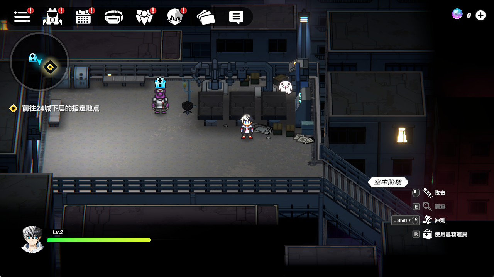

**Almost done, still fixing some bugs in gacha step**

### About

An auto tool for game-remaking.

~~used for creating new account~~

### Dependency

* pyautogui
* opencv

### Game need

* Already reach the following progress.
* 1920*1080 screen size

### Notice

* Variable `START_INTERVAL` (default: 3) in "basic_module.py" should be adjusted according to your hardware.
* You need to modify `HIGH_RANK_CHARACTE` (default: 2) and `GACHA_TIMES` (default: 2) in "in_game.py" for specific goal.

## **Please do not use for commercial purposes.**
